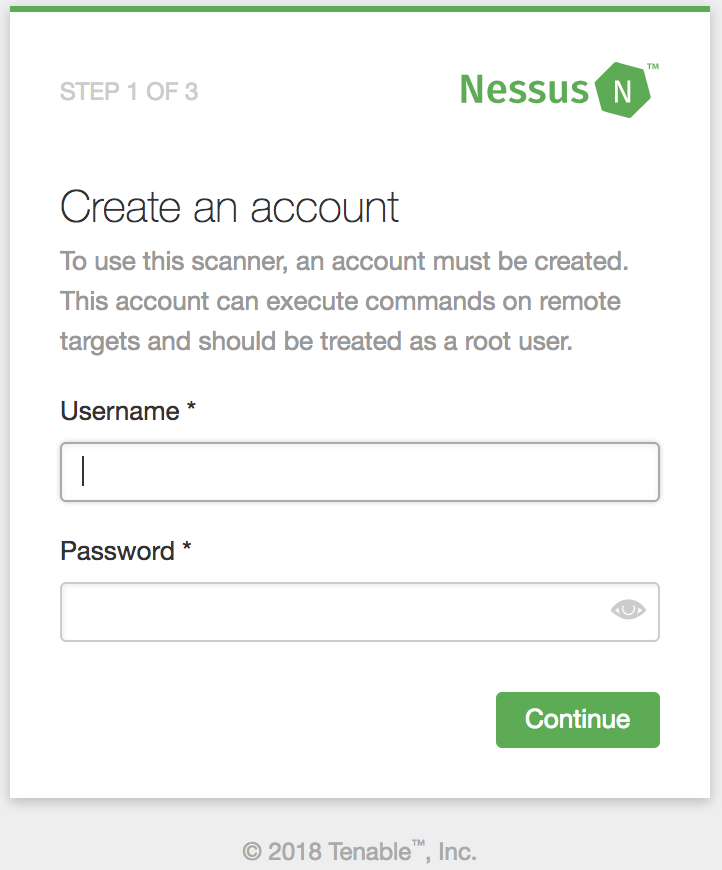
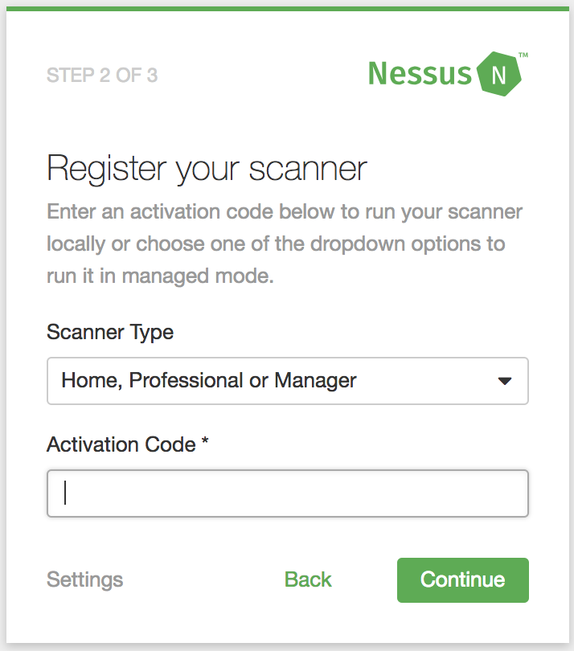
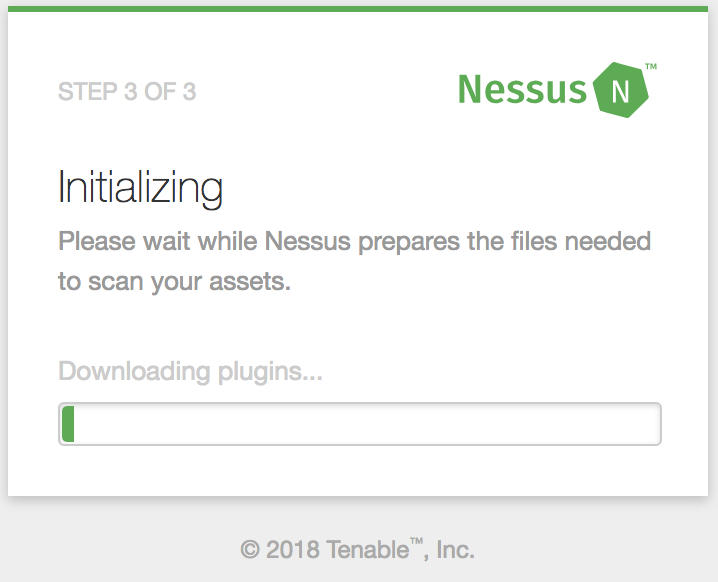

## Latest Nessus Vulnerability Scanner Docker Image
* Checkout the code using
```
$ git clone https://github.com/praveendhac/nessus-docker
$ cd nessus-docker
```

* Execute below commans to build docker image and start nessus Container
```
$ docker-compose -f docker-compose.yaml up
Building nessus
Step 1/8 : FROM ubuntu:16.04
 ---> 5e8b97a2a082
Step 2/8 : RUN apt-get update
 ---> Running in a93b7f5900ab
....snip....
Fetched 25.3 MB in 2s (8689 kB/s)
Reading package lists...
Removing intermediate container a93b7f5900ab
 ---> cadf61d27904
Step 3/8 : RUN apt-get install -y net-tools iputils-ping tzdata
 ---> Running in 2c59eee34dc3
....snip....
Step 4/8 : RUN rm -rf /var/lib/apt/lists/*
 ---> Running in 2ff140212b19
Removing intermediate container 2ff140212b19
 ---> 9656babec872
Step 5/8 : COPY Nessus-7.1.1-ubuntu1110_amd64.deb /tmp/Nessus.deb
 ---> 334180e1f817
Step 6/8 : RUN dpkg -i /tmp/Nessus.deb
 ---> Running in 96f0dd9e9155
Preparing to unpack /tmp/Nessus.deb ...
Unpacking nessus (7.1.1) ...
Setting up nessus (7.1.1) ...
Unpacking Nessus Core Components...

# nessus-docker
 - You can start Nessus by typing /etc/init.d/nessusd start
 - Then go to https://96f0dd9e9155:8834/ to configure your scanner

Step 7/8 : EXPOSE 8834
 ---> Running in 39c904011360
Removing intermediate container 39c904011360
 ---> df52b2233bbe
Step 8/8 : ENTRYPOINT [ "/opt/nessus/sbin/nessusd" ]
 ---> Running in 8530df768ebb
Removing intermediate container 8530df768ebb
 ---> 600640e272d5

Successfully built 600640e272d5
Successfully tagged nessus-docker_nessus:latest
WARNING: Image for service nessus was built because it did not already exist. To rebuild this image you must use `docker-compose build` or `docker-compose up --build`.
Recreating nessus-docker_nessus_1 ... error

Recreating 3db3b5f12c7e_nessus-docker_nessus_1 ... done
Attaching to nessus-docker_nessus_1
nessus_1  | nessusd (Nessus) 7.1.1 [build M20117] for Linux
nessus_1  | Copyright (C) 1998 - 2018 Tenable, Inc.
nessus_1  |
nessus_1  | Processing the Nessus plugins...
[##################################################]
nessus_1  |
nessus_1  | All plugins loaded (1sec)
```

* Execute below commans to view list of running containers
```
$ docker ps
CONTAINER ID  IMAGE                 COMMAND                 CREATED             STATUS              PORTS                   NAMES
6d330adac564  nessus-docker_nessus  "/opt/nessus/sbin/ne…"  About a minute ago  Up About a minute   0.0.0.0:9934->8834/tcp  nessus-docker_nessus_1
```
* Withing container nessusd listens on 8834, exposing usin 9934/tcp on host machine. Using 9934 to overcome port binding issues if someone already installed nessus on their local host.

* If the container has successfully started, we can access it from browser using
https://localhost:9934

- At step 1, create username, password



- At step 2, generate "Activation Code". (search google for "nessus + activation code")



- At step 3, Nessus starts initializing



* We can login to the container using below command (got the id from `docker ps` command)
```
$ docker exec -it 6d330adac564 bash
```

# To build docker image of different OS
We need to modify `nessus-scanner/Dockerfile`, nothing to modify in `docker-compose.yaml`
* Change `FROM` to the OS of your interest (`FROM ubuntu:16.04` to `FROM centos:7`)
* Change `RUN` commands reflecting the OS, say using yum, apk etc.
* Download image specific to the OS of interest, place it in `nessus-scanner` directory
* `RUN` the installation command specific to OS (dpkg, rpm, apk add etc.)
* Change `ENTRYPOINT` reflecting the path where nessus is installed
